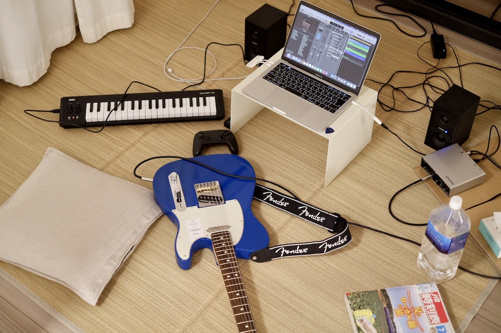

# keisei

平成5年11月3日生まれ 茨城県出身

2008年よりニコニコ動画を中心にオリジナル曲を投稿。

「マジカルミライ2017 楽曲コンテスト」に応募した「Singularity」が  
グランプリとして採用され、同イベントで演奏される。

主な経歴

- マジカルミライ2017 楽曲コンテスト グランプリ
- マジカルミライ2017〜2018, SNOW MIKU 2018 DJ出演
- マジカルミライ2021 Blu-ray&DVD限定盤 店舗別特典リミックスCD

## 使用機材

- MacBook Air (M1, 2020)
- Logic Pro
- 初音ミクNT
- Fender Made in Japan Hybrid II Telecaster
- YAMAHA BB434
- オーディオテクニカ ATH-M70x
- GENELEC G One
- オーディオテクニカ AT2020
- KORG microKEY Air 37
- Pioneer DDJ-800
- Steinberg UR12

