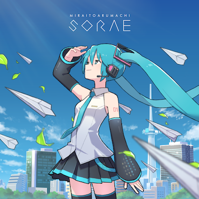
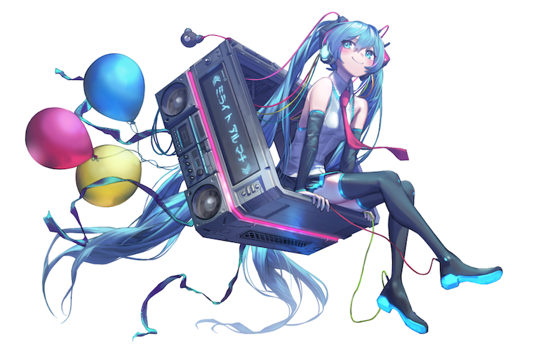
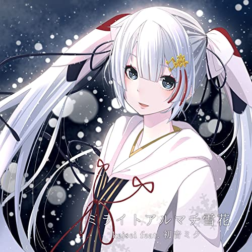
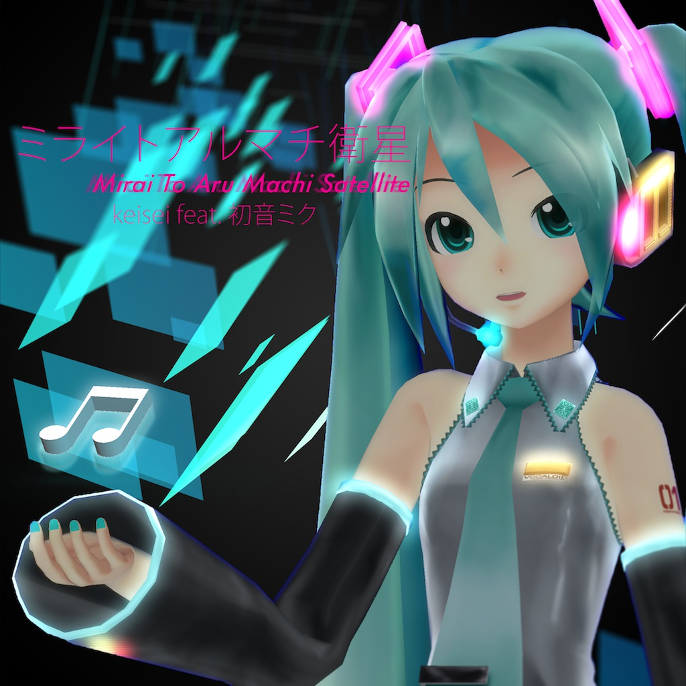
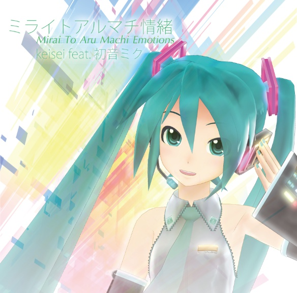
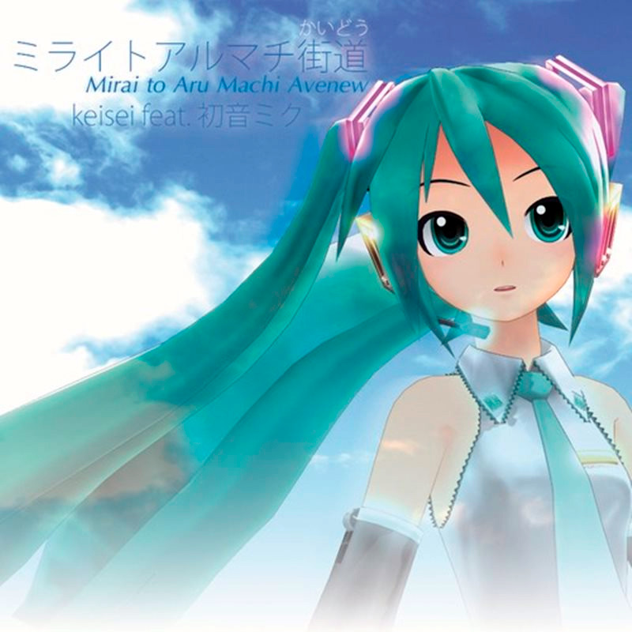

# discography

[album, ep](./discography) [single](./single)

## album, ep

### ミライトアルマチ空絵

<iframe class="bandcamp-player" src="https://bandcamp.com/EmbeddedPlayer/album=3409945041/size=large/bgcol=333333/linkcol=4ec5ec/tracklist=false/artwork=none/transparent=true/" seamless><a href="https://miraitoarumachi.bandcamp.com/album/mirai-to-aru-machi-sorae-reprise">Mirai To Aru Machi Sorae (Reprise) by keisei</a></iframe>

イラスト OTOMIKA [Tumblr](https://otomikakei.tumblr.com)

1. きみの後ろ姿を視ていた
2. zenmaikatatenikimiwadokoe
3. クリムゾンビート (sorae mix)
4. WALK AROUND STEREO (sorae mix)
5. きみの後ろ姿を視ていた (Instrumental)
6. zenmaikatatenikimiwadokoe (Instrumental)
7. クリムゾンビート (sorae mix Instrumental)
8. WALK AROUND STEREO (sorae mix Instrumental)

### ミライトアルマチ都々里

<iframe class="bandcamp-player" src="https://bandcamp.com/EmbeddedPlayer/album=2588944704/size=large/bgcol=333333/linkcol=4ec5ec/tracklist=false/artwork=none/transparent=true/" seamless><a href="https://miraitoarumachi.bandcamp.com/album/mirai-to-aru-machi-tsuzuri">Mirai To Aru Machi Tsuzuri by keisei</a></iframe>

イラスト ゲソきんぐ [Twitter](https://twitter.com/Gesoking06)

1. :tada:
1. ステートマシン
1. contrail
1. Helium
1. #cityelectronic1546881480
1. ゆらぎ
1. mic test
1. ファンメイドライフ
1. cloudway (tsuzuri mix)
1. ホワイトキャンバスホワイトノイズ
1. tsuzuri

### ミライトアルマチ延寿

<iframe class="bandcamp-player" src="https://bandcamp.com/EmbeddedPlayer/album=1970150176/size=large/bgcol=262a2b/linkcol=4ec5ec/tracklist=false/artwork=none/transparent=true/" seamless><a href="https://miraitoarumachi.bandcamp.com/album/mirai-to-aru-machi-enju">Mirai To Aru Machi Enju by keisei</a></iframe>

1. アトリウム
1. ＃918D40
1. うららすてっぷ♪
1. Hifumi
1. ＃wonderreport
1. envelope
1. 午前三時のメロウ
1. キラキラレンレンコンテスト
1. キラキラKAITOコンテスト
1. pretty
1. dasher
1. tetra

### ミライトアルマチ雪花

イラスト Kazuna [Twitter](https://twitter.com/kazzzuna)

1. Hifumi
1. envelope
1. 地図にない街 (Sekka mix)
1. Singularity (Sekka mix)
1. ブライトシティ (Reno Remix)
1. Hifumi (Instrumental)
1. envelope (Instrumental)

### ミライトアルマチ詩恩

1. ゆめアップロード
1. saku*life
1. Blinking Blank
1. #cityelectronic1477754787 「街観図」
1. prologue
1. Does this make sense
1. birthday

### ミライトアルマチ衛星

1. 夢の魔法
1. サクラセンセーショナル
1. ブライトシティ
1. smile chain
1. hoshi no orchestra
1. urban hallucination
1. crosswing (Satellite mix)
1. 地図にない街 (fjsmu remix)
1. ココロターミナル (mt remix)
1. 夢の魔法 (NUSH mix)
1. IRIS SCREEN (robo party edge rmx)
1. ブライトシティ (Osanzi remix)

### ミライトアルマチ情緒

1. 明日見る街
1. 桜色エレクトロ
1. yanesen
1. cloudway
1. Urban Stroke
1. IRIS SCREEN
1. ココロターミナル
1. Turbo Orbit
1. WALK AROUND STEREO
1. はるかGlider (Higher than the stars Remix)
1. ココロターミナル (Sky Lounge Remix)
1. 地図にない街 (haru2036 remix)

### ミライトアルマチ街道

1. 地図にない街
1. Polka dot
1. はるかGlider
1. Breath of Urban
1. Electrail
1. PIKTOGRAM  
1. Hearting Linking  
1. a neo world (2013 Extended Mix)
1. trans-Create
