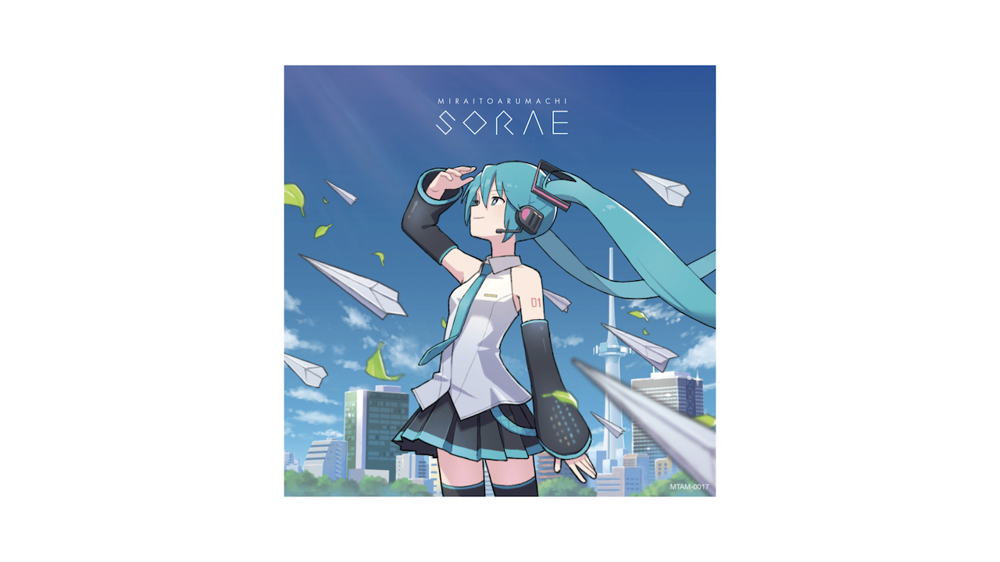

  

2023/02/04 ミライトアルマチ空絵の再録版をリリースしました。
CDは[BOOTH](https://miraitoarumachi.booth.pm/items/4527914) wav音源は [Bandcamp](https://miraitoarumachi.bandcamp.com/album/mirai-to-aru-machi-sorae-reprise) よりお求めいただけます。

# about

[biography](/biography) 
[activities](/activities) 
[discography](/discography) 
[live](/live) 
[楽曲利用のきまり (usage policy)](/usage_policy)

# links

[ニコニコ動画](http://www.nicovideo.jp/mylist/10180194) 
[YouTube](https://youtube.com/user/keisei1092) 
[Bandcamp](https://https://miraitoarumachi.bandcamp.com) 
[SoundCloud](https://soundcloud.com/keisei_1092) 
[ピアプロ](https://piapro.jp/keisei_1092)

## store

[AKIBA-HOBBY](https://ec.akbh.jp/products/list.php?maker_id=102) 
[BOOTH](https://miraitoarumachi.booth.pm)

## fan

[pixivFANBOX](https://www.pixiv.net/fanbox/creator/604687)

# note

[freebies](/freebies) 
[album](/album) 
[special thanks](/special_thanks)
